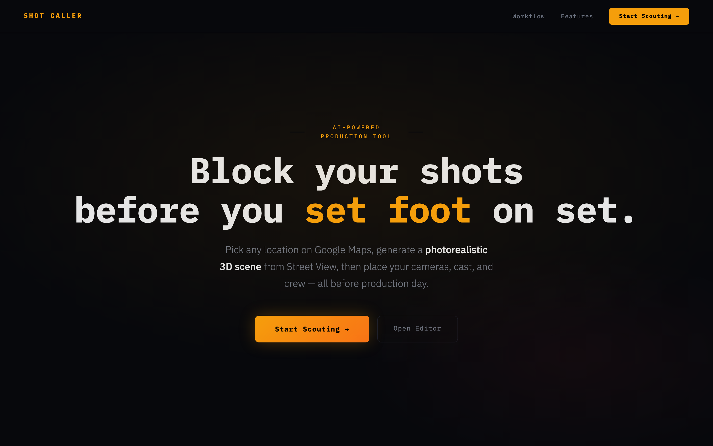
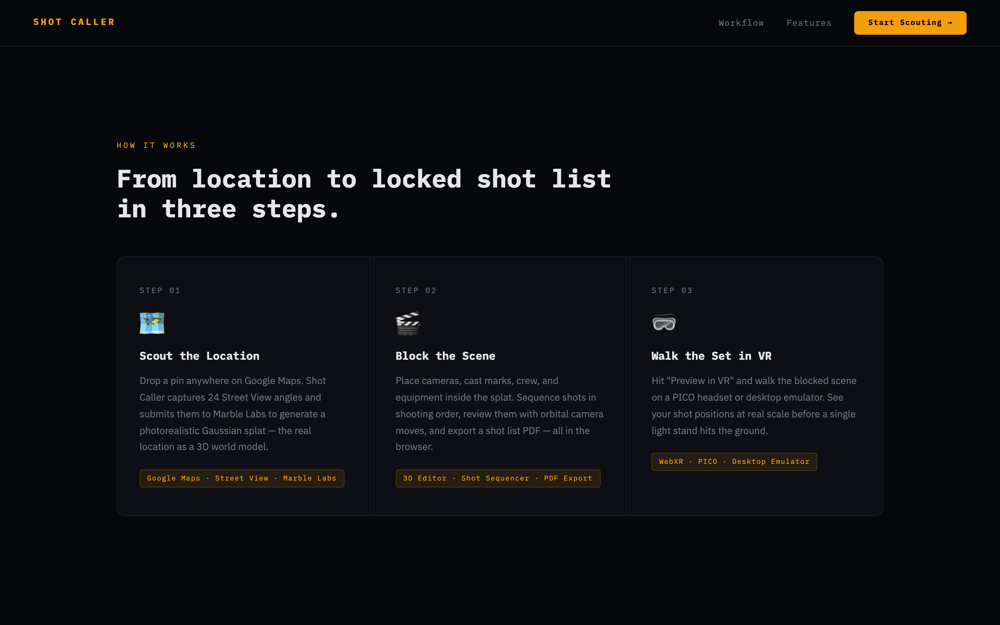
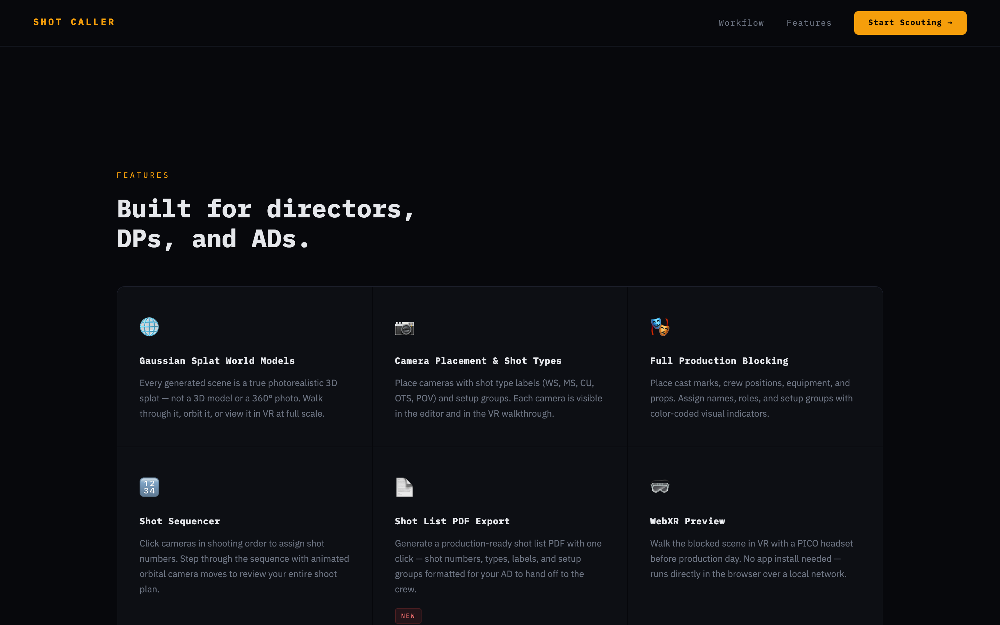
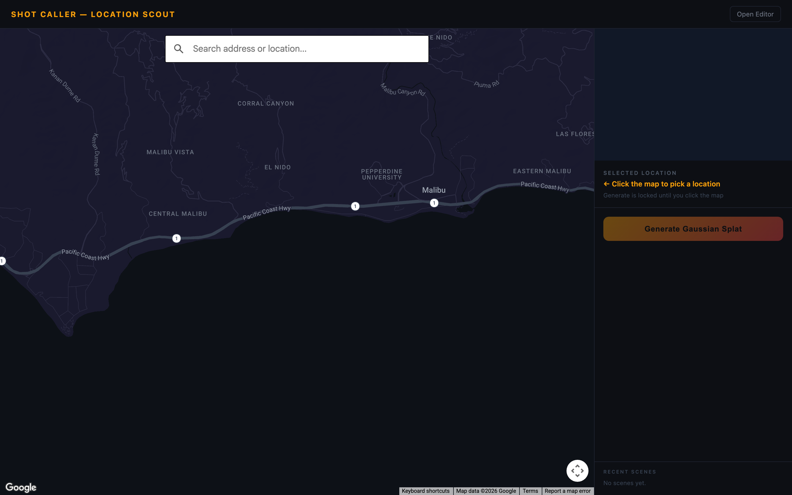
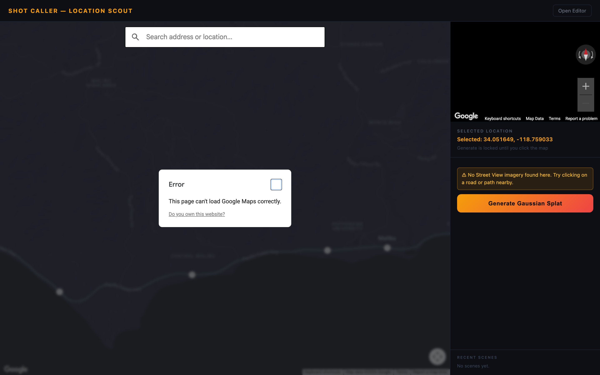
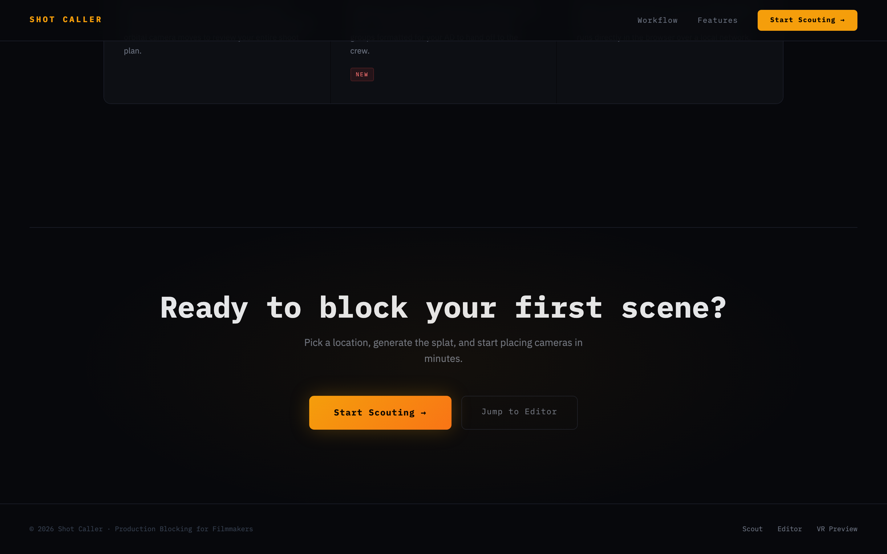

# Shot Caller

> Plan your shoot on a laptop. Walk it in VR. Let AI write the call sheet.

Shot Caller is a **WebXR production planning tool for filmmakers**. Pick any real-world location on Google Maps, generate a photorealistic 3D Gaussian splat of that space, block your cameras and lights in a spatial editor, sequence your shots, walk the set in VR on a PICO headset, and let Claude AI generate a production call sheet — all without stepping foot on location.

Built at the [World Model Hackathon](https://luma.com/worldsinaction-sf26) — SensAI × PICO, March 2026.

**[Live Demo](https://hackathon.cloudagi.org)** · **[DevPost](https://devpost.com/software/shot-caller)**

---



---

## What it does

Shot Caller turns a filmmaker's spoken vision into a walkable 3D world so you can block shots and export a storyboard — without drawing any scenes or stepping on set.

### Four modes, one URL:

| Mode | Surface | What happens |
|------|---------|--------------|
| **Scout** | Desktop | Search any address on Google Maps → preview Street View → generate a 3D Gaussian splat via World Labs Marble API |
| **Editor** | Desktop | Place cameras (with FOV cones), lights (with coverage cones), crew markers, cast marks, and equipment in the 3D world. Sequence shots and group lighting setups. |
| **VR Preview** | PICO headset | Same URL auto-detects WebXR → immersive walkthrough of the fully blocked scene at real-world scale |
| **Call Sheet** | Desktop | Claude AI reads your blocking plan → generates shooting order, equipment list, department call times → exports as PDF |

---

## Demo

**Live demo:** [https://hackathon.cloudagi.org](https://hackathon.cloudagi.org)

---

## Screenshots

### Landing Page — How It Works

*Three-step workflow: Scout the Location → Block the Scene → Walk the Set in VR*

### Features Overview

*Gaussian Splat World Models, Camera Placement, Full Production Blocking, Shot Sequencer, PDF Export, WebXR Preview*

### Scout Mode — Google Maps Location Picker

*Search any address, preview the location on Google Maps, and generate a Gaussian splat*

### Scout Mode — Location Selected

*Selected coordinates with Street View preview, ready to generate a 3D world model*

### Full Landing Page


---

## Tech stack

```
Frontend         Three.js r181 · IWSDK (ElixrJS) · SparkJS 2.0 · Vite · TypeScript
World model      World Labs Marble API (Gaussian splat generation from Street View imagery)
Location data    Google Maps Static API · Google Street View Static API · Places Autocomplete
XR               WebXR Device API · PICO 4 browser · IWER emulator for desktop testing
AI agents        Claude API (claude-sonnet-4-6) via Anthropic SDK · Mastra Framework
Scene state      Vercel KV (Redis) · localStorage fallback
Export           jsPDF · Three.js orthographic renderer
Backend          Express 5 · Node.js · TypeScript · Zod
Base template    sensai-webxr-worldmodels (IWSDK + SparkJS + PICO emulator)
```

---

## Architecture

```
Browser (Desktop)                    Browser (PICO)
┌─────────────────────────┐          ┌──────────────────────────┐
│  Three.js Orbit Editor  │          │  IWSDK XR Session        │
│  - Camera + FOV cone    │          │  - SparkJS .spz render   │
│  - Light + coverage     │  same    │  - GLTF elements at      │
│  - Crew / cast markers  │  URL ──► │    real scale            │
│  - Shot sequencing      │          │  - Shot number badges    │
│  - Setup grouping       │          │  - Locomotion (PICO)     │
└────────────┬────────────┘          └──────────────────────────┘
             │ scene JSON
             ▼
┌─────────────────────────────────────────────────────────────┐
│                    Vercel Serverless                        │
│                                                             │
│  /api/generate-world   Maps imagery → Marble → .spz        │
│  /api/scene            POST/GET scene JSON (Vercel KV)      │
│  /api/callsheet        Scene JSON → Claude API → call sheet │
│  /api/export-pdf       Floor plan PNG + call sheet → PDF   │
└─────────────────────────────────────────────────────────────┘
             │                │                │
             ▼                ▼                ▼
      Marble API        Vercel KV        Claude API
   (world gen)        (scene state)   (call sheet gen)
```

---

## Getting started

### Prerequisites

- Node.js >= 20.19.0
- A WebXR-capable browser (Chrome recommended for desktop)
- PICO 4 headset for VR preview (optional — desktop emulator available)

### Environment variables

Copy `.env.example` to `.env.local` and fill in your keys:

```env
GOOGLE_MAPS_API_KEY=        # Google Cloud — Maps Static API + Street View Static API
MARBLE_API_KEY=             # World Labs — marble.worldlabs.ai
ANTHROPIC_API_KEY=          # Anthropic — console.anthropic.com
KV_REST_API_URL=            # Vercel KV — from Vercel dashboard
KV_REST_API_TOKEN=          # Vercel KV — from Vercel dashboard
```

### Install and run

```bash
npm install
npm run dev
```

Open [http://localhost:5173](http://localhost:5173) in your browser.

**PICO testing:** Use `npm run dev -- --host` to expose on your local network, then open the IP address in the PICO browser. Or deploy to Vercel for HTTPS (required for WebXR on device).

### Deploy to Vercel

```bash
npm install -g vercel
vercel
```

Add your environment variables in the Vercel dashboard under Project Settings → Environment Variables.

---

## Project structure

```
shot-caller-vr/
├── src/
│   ├── index.ts              # Entry point — mode detection + scene init
│   ├── editor/
│   │   ├── Editor.ts         # Three.js orbit scene, OrbitControls
│   │   ├── ElementManager.ts # Place, select, drag production elements
│   │   ├── SequenceMode.ts   # Shot numbering, type tagging, setup groups
│   │   └── elements/
│   │       ├── Camera.ts     # Camera GLTF + CameraHelper FOV cone
│   │       ├── Light.ts      # Light GLTF + SpotLight coverage cone
│   │       ├── CrewMark.ts   # Crew position silhouette + role label
│   │       └── CastMark.ts   # Floor X + character name + eyeline
│   ├── vr/
│   │   ├── VRScene.ts        # IWSDK XR session + SparkJS splat loader
│   │   ├── ElementRenderer.ts# Render scene JSON elements in XR
│   │   └── Locomotion.ts     # PICO controller teleport + smooth walk
│   ├── scene/
│   │   ├── SceneManager.ts   # Serialise / deserialise scene JSON
│   │   └── types.ts          # Scene JSON schema types
│   └── ui/
│       ├── Sidebar.ts        # Element picker + sequence mode controls
│       ├── CallSheetPanel.ts # Render AI call sheet output
│       └── ExportPanel.ts    # Export controls + shareable URL
├── api/
│   ├── generate-world.ts     # Maps + Marble API → .spz
│   ├── scene.ts              # Vercel KV scene CRUD
│   ├── callsheet.ts          # Claude API call sheet generation
│   └── export-pdf.ts         # PDFKit PDF generation
├── public/
│   └── assets/
│       └── models/           # Pre-built GLTF production elements
│           ├── camera.glb
│           ├── light-led.glb
│           ├── light-fresnel.glb
│           ├── crew-silhouette.glb
│           ├── dolly.glb
│           └── c-stand.glb
├── index.html
├── vite.config.ts
├── tsconfig.json
└── .env.example
```

---

## Scene JSON schema

The core data structure shared between the editor, VR mode, and AI agent:

```typescript
interface SceneJSON {
  id: string
  location: {
    address: string
    lat?: number
    lng?: number
  }
  splatUrl: string          // CDN URL of the .spz world file
  meshUrl: string           // CDN URL of the .glb collision mesh
  elements: ProductionElement[]
  createdAt: string
  updatedAt: string
}

interface ProductionElement {
  id: string
  type: 'camera' | 'light' | 'crew' | 'cast' | 'equipment' | 'setdressing'
  label: string
  position: { x: number; y: number; z: number }
  rotation: { x: number; y: number; z: number }

  // Camera-specific
  focalLength?: number
  shotNumber?: number       // Shot sequence order
  shotType?: 'Wide' | 'Medium' | 'CU' | 'OTS' | 'Insert' | 'POV'
  shotLabel?: string
  setupGroup?: 'A' | 'B' | 'C' | 'D'

  // Light-specific
  colourTemp?: number       // Kelvin
  lightType?: 'LED' | 'Fresnel' | 'Practical' | 'HMI'

  // Crew-specific
  role?: string             // e.g. "DP", "1st AC", "Gaffer"
  department?: string
}
```

---

## AI call sheet agent

The `/api/callsheet` endpoint sends the scene JSON to Claude with a structured prompt and returns:

```typescript
interface CallSheetJSON {
  shootingOrder: {
    setupGroup: string
    shots: { shotNumber: number; type: string; label: string; cameraId: string }[]
    lightingNotes: string
    estimatedMinutes: number
  }[]
  equipmentList: {
    item: string
    quantity: number
    department: string
  }[]
  departmentCalls: {
    department: string
    callTime: 'First' | 'After camera' | 'After lighting'
    notes: string
  }[]
  totalEstimatedMinutes: number
  productionNotes: string
}
```

The agent reasons about shooting order efficiency (grouping by setup group to minimise lighting turnaround), equipment quantities (derived from element counts and types), department dependencies (crane placed → grip department call), and setup time estimates.

---

## Team

| Name | Role |
|------|------|
| Mark Harmon | Project Lead · Full-Stack · World Model Pipeline |
| Arya Teja Rudraraju | AI Integration · Call Sheet Generation · DevOps |
| Aditya Dev Singh | Frontend · 3D Editor · Scene Management |
| Sean Tai | VR Integration · WebXR · PICO Testing |
| V4C38 | Base Template · IWSDK · SparkJS Integration |

---

## Acknowledgements

- [SensAI Hackademy](https://sensaihackademy.com/) and [PICO](https://www.picoxr.com/global) for organising the World Model Hackathon
- [World Labs](https://www.worldlabs.ai/) for the Marble API and the [sensai-webxr-worldmodels](https://github.com/V4C38/sensai-webxr-worldmodels) template
- [SparkJS](https://sparkjs.dev/) for the open-source Gaussian splat renderer
- [IWSDK / ElixrJS](https://elixrjs.io/) for the WebXR framework
- [Anthropic](https://anthropic.com) for the Claude API
- [Kenney.nl](https://kenney.nl) and [Mixamo](https://mixamo.com) for free GLTF assets

---

## License

MIT
